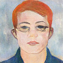

## Peixian Zhuang （庄培显）
**Postdoctoral Fellow (博士后研究员, 助理研究员), advised by Prof. Qionghai Dai (中国工程院院士、国务院参事、CAAI理事长、清华大学信息学院院长), Tsinghua University（清华大学）**. **IEEE, CCF and CAAI Member**. I received Ph.D. degree from the School of Information Science and Engineering, Xiamen University in 2016. I am a winner of the **Best PhD. Thesis Award in Fujian Province**（**福建省优秀博士学位论文**）in 2017. From 2017.02 to 2020.07, I am a Lecturer and Master Supervisor in the School of Electronic and Information Engineering, Nanjing University of Information Science and Technology. My research interests focus on Bayesian modeling, sparse image representation and deep learning, including image restoration, image naturalization, medical image reconstruction, remote sensing fusion, and underwater image enhancement, and so on.

### Google Citation：178+.   
### SCI IF：40+
Website: http://www.escience.cn/people/zhuangpeixian/index.html

### Last News
0. Lastest News: I will be honor to join the BBNC lab (http://media.au.tsinghua.edu.cn/) as a Postdoctoral Fellow, advised by Prof. Qionghai Dai！
1. Recent News: I am honor to be an Editor Board Member for Journal of Electronics and Advanced Electrical Engineering, and an Associate Editor for Computer Methods in Biomechanics and Biomedical Engineering: Imaging & Visualization! Hope you will contribute your manuscript on these journals!
2. Two papers titled “An efficient underwater image enhancement model with extensive Beer-Lambert law”and “Blind image deblurring with joint extreme channels and L0-regularized intensity and gradient priors” have been accepted on 2020 IEEE International Conference on Image Processing (IEEE ICIP, CCF推荐EI会议, 信号处理3大旗舰会议之一)！
3. One paper titled “Bayesian Pan-sharpening with Multi-order Gradient-based Deep Network Constraints”  has been accepted on IEEE Journal of Selected Topics in Applied Earth Observations and Remote Sensing (SCI JCR 2区, IF: 3.392)！
4. Two papers titled “Underwater Image Enhancement with a Total Generalized Variation Illumination Prior” and “Underwater Image Enhancement based on Dehazing and Color Correction” have been accepted on 2019 IEEE International Symposium on Parallel and Distributed Processing with Applications (IEEE ISPA, EI, CCF推荐, 并行和分布式应用处理国际会议) ！
5. One paper titled “Underwater Image Enhancement Using An Edge-Preserving Filtering Retinex Algorithm” has been accepted on Multimedia Tools and Applications (SCI JCR 4区, CCF推荐,IF：2.101) !
6.  I am honor to be a member of Technical Committee on 2020 International Conference on Image and Graphics Processing (图像与图形处理国际EI会议) ！And one paper titled “An Enhancing Approach for Typhoon Cloud Image” has been accepted on 2020 International Conference on Image and Graphics Processing, Oral Presentation (图像与图形处理国际EI会议) !
7. One paper titled “Compressed Sensing MRI with Joint Image-Level and Patch-Level Priors” has been accepted on 2019 IEEE International Conference on Image Processing, Poster Presentation (IEEE ICIP, CCF推荐EI会议, 信号处理3大旗舰会议之一) ！
8. One paper titled “Divide and Conquer Framework for Image Restoration and Enhancement” has been accepted on Engineering Applications of Artificial Intelligence (SCI JCR 2区, CCF推荐, IF：3.526) !
9. Two papers titled “Pan-GGF: A Probabilistic Method for Pan-sharpening With Gradient Domain Guided Image Filtering” and “MRI Reconstruction with an Edge-Preserving Prior” have been accepted on Signal Processing (信号处理TOP期刊，SCI JCR 1区, CCF推荐, IF：4.086) ！
10. One paper titled “Underwater Image Enhancement Using a Multi-Scale Dense Generative Adversarial Network” has been accepted on IEEE Journal of Oceanic Engineering (海洋工程TOP期刊, SCI JCR 2区, IF：2. 435) !
11. I am honor to be the Session Chair (Image Processing II) and a member of Technical Committee on 2019 IEEE International Conference on Signal and Image Processing (IEEE ICSIP, 信号与图像处理国际EI会议) ！
12. Two papers titled “Pan-sharpening with a Gradient Domain Guided Image Filtering Prior” and “Underwater Image Enhancement by Gaussian Curvature Filter” have been accepted on 2019 IEEE International Conference on Signal and Image Processing, Oral Presentation (IEEE ICSIP, 信号与图像处理国际EI会议) ！
13. One paper titled “Compressed Sensing MRI via a Multi-scale Dilated Residual Convolution Network” has been accepted on Magnetic Resonance Imaging (SCI JCR 3区, IF：2.564) !
14. One paper titled “Pan-sharpening via a gradient-based deep network prior” has been accepted on Signal Processing: Image Communications (SCI JCR 2区, CCF推荐, IF：2. 814) !
15. One paper titled “Removing Stripe Noise from Infrared Cloud Image via Deep Convolutional Network” has been accepted on IEEE Photonics Journal (SCI JCR 3区, IF：2. 627) !
16. I win to be a Professional Master Supervisor in School of Electronic and Information Engineering, Nanjing University of Information Science and Technology (2017.02-2020.02)!
17. I am a winner of the Best PhD. Thesis Award in Fujian Province in 2017 (福建省优秀博士学位论文)!
18. I win the National Natural Science Foundation of China under Grant (国家自然科学基金青年项目, No. 61701245, 2018.01-2020.12)！

### Publication
0. Peixian Zhuang, Kai Zhou, MGF: 

