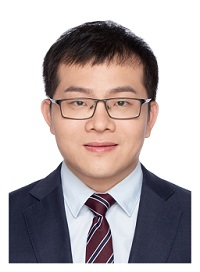

 
## Peixian Zhuang （庄培显）
Currently, I am **IEEE, CCF and CAAI Member**, and **Postdoctoral Fellow (博士后, 助理研究员), advised by Prof. Qionghai Dai (戴琼海教授, 中国工程院院士、国务院参事、中国人工智能学会理事长、清华大学信息学院院长), Tsinghua University（清华大学）**. I received Ph.D. degree from the School of Information Science and Engineering, Xiamen University in 2016. I am a winner of the **Best PhD. Thesis Award in Fujian Province**（**福建省优秀博士学位论文**）in 2017. From 2017.02 to 2020.07, I am a **Lecturer (讲师)** and **Master Supervisor（硕士生导师）**in the School of Electronic and Information Engineering, **Nanjing University of Information Science and Technology (南京信息工程大学，双一流建设大学)**. My research interests focus on Bayesian modeling, sparse representation and deep learning, including image restoration, image naturalization, medical image reconstruction, remote sensing fusion, and underwater image enhancement, and so on. And my current interests focus on Neuron signal extraction and calcium signal descattering in the BBNC Lab.

### Note: I am looking for a teaching position of a university in Beijing! 

### Matlab Code! Retinex Variational Underwater Image Enhancement (https://github.com/zhuangpeixian) 

### Last News
0. Lastest News: I win the National Natural Science Foundation of China under Grant (国家自然科学基金面上项目, No. 62171252, 2022.01-2025.12)！
1. Lastest News: Our paper titled 'Underwater Image Enhancement Using a Multi-Scale Dense Generative Adversarial Network' has been the ESI Highly Cited Paper（ESI高被引论文）！ 
2. Lastest News: I win the General Program from China Postdoctoral Science Foundation (中国博士后科学基金面上项目, 2021.11-2022.09)！ 
3. Lastest News: Our paper titled 'A retinex-based enhancing approach for single underwater image' has reached 200+ google scholar‬ citations（200次谷歌学术引用）！ 
4. Recent News: I am honor to join the BBNC lab (http://media.au.tsinghua.edu.cn/) as a Postdoctoral Fellow, advised by Prof. Qionghai Dai (戴琼海教授, 中国工程院院士、国务院参事、中国人工智能学会理事长、清华大学信息学院院长)！
5. I am honor to be an Editor Board Member for Journal of Electronics and Advanced Electrical Engineering, and an Associate Editor for Computer Methods in Biomechanics and Biomedical Engineering: Imaging & Visualization! Hope you will contribute your manuscript on these journals!
6. Two papers titled “An efficient underwater image enhancement model with extensive Beer-Lambert law”and “Blind image deblurring with joint extreme channels and L0-regularized intensity and gradient priors” have been accepted on 2020 IEEE International Conference on Image Processing (IEEE ICIP, CCF推荐EI会议, 信号处理3大旗舰会议之一)！
7. One paper titled “Bayesian Pan-sharpening with Multi-order Gradient-based Deep Network Constraints”  has been accepted on IEEE Journal of Selected Topics in Applied Earth Observations and Remote Sensing (SCI JCR 2区, IF: 3.392)！
8. Two papers titled “Underwater Image Enhancement with a Total Generalized Variation Illumination Prior” and “Underwater Image Enhancement based on Dehazing and Color Correction” have been accepted on 2019 IEEE International Symposium on Parallel and Distributed Processing with Applications (IEEE ISPA, EI, CCF推荐, 并行和分布式应用处理国际会议) ！
9. One paper titled “Underwater Image Enhancement Using An Edge-Preserving Filtering Retinex Algorithm” has been accepted on Multimedia Tools and Applications (SCI JCR 4区, CCF推荐,IF：2.101) !
10.  I am honor to be a member of Technical Committee on 2020 International Conference on Image and Graphics Processing (图像与图形处理国际EI会议) ！And one paper titled “An Enhancing Approach for Typhoon Cloud Image” has been accepted on 2020 International Conference on Image and Graphics Processing, Oral Presentation (图像与图形处理国际EI会议) !
11. One paper titled “Compressed Sensing MRI with Joint Image-Level and Patch-Level Priors” has been accepted on 2019 IEEE International Conference on Image Processing, Poster Presentation (IEEE ICIP, CCF推荐EI会议, 信号处理3大旗舰会议之一) ！
12. One paper titled “Divide and Conquer Framework for Image Restoration and Enhancement” has been accepted on Engineering Applications of Artificial Intelligence (SCI JCR 2区, CCF推荐, IF：6.212) !
13. Two papers titled “Pan-GGF: A Probabilistic Method for Pan-sharpening With Gradient Domain Guided Image Filtering” and “MRI Reconstruction with an Edge-Preserving Prior” have been accepted on Signal Processing (信号处理顶级期刊，SCI JCR 1区, CCF推荐, IF：4.662) ！
14. One paper titled “Underwater Image Enhancement Using a Multi-Scale Dense Generative Adversarial Network” has been accepted on IEEE Journal of Oceanic Engineering (海洋工程顶级期刊, SCI JCR 2区, IF：2. 435) !
15. I am honor to be the Session Chair (Image Processing II) and a member of Technical Committee on 2019 IEEE International Conference on Signal and Image Processing (IEEE ICSIP, 信号与图像处理国际EI会议) ！
16. Two papers titled “Pan-sharpening with a Gradient Domain Guided Image Filtering Prior” and “Underwater Image Enhancement by Gaussian Curvature Filter” have been accepted on 2019 IEEE International Conference on Signal and Image Processing, Oral Presentation (IEEE ICSIP, 信号与图像处理国际EI会议) ！
17. One paper titled “Compressed Sensing MRI via a Multi-scale Dilated Residual Convolution Network” has been accepted on Magnetic Resonance Imaging (核磁共振成像权威期刊, SCI JCR 4区, IF：2.564) !
18. One paper titled “Pan-sharpening via a gradient-based deep network prior” has been accepted on Signal Processing: Image Communications (SCI JCR 2区, CCF推荐, IF：2. 814) !
19. One paper titled “Removing Stripe Noise from Infrared Cloud Image via Deep Convolutional Network” has been accepted on IEEE Photonics Journal (SCI JCR 3区, IF：2. 627) !
20. I win to be a Professional Master Supervisor in School of Electronic and Information Engineering, Nanjing University of Information Science and Technology (2017.02-2020.02)!
21. I am a winner of the Best PhD. Thesis Award in Fujian Province in 2017 (福建省优秀博士学位论文)!
22. I win the National Natural Science Foundation of China under Grant (国家自然科学基金青年项目, No. 61701245, 2018.01-2020.12)！

### Google Citation：496+   
### SCI IF：50+

### Publications (* corresponding author)
0. Peixian Zhuang, Jiamin Wu*. Reinforcing neuron extraction from calcium imaging data via depth-estimation constrained nonnegative matrix factorization. Submitted to 2022 IEEE International Conference on Image Processing (EI, CCF推荐, 图像处理旗舰会议)  
1. Peixian Zhuang*, Chongyi Li, Jiamin Wu, Fatih Porikli. Underwater Image Enhancement with Hyper-Laplacian Reflectance Priors. Submitted to IEEE Transactions on Image Processing, Peer Review.
2.  Weidong Zhang, Chongyi Li*, Peixian Zhuang, Haihan Sun, Guohou Li, Sam Kwong. Underwater Image Enhancement via Minimal Color Loss and Locally Adaptive Contrast Enhancement. Submitted to IEEE Transactions on Image Processing, Major Revision.
3. **Peixian Zhuang***. Retinex Underwater Image Enhancement with Multi-Order Gradient Priors. IEEE International Conference on Image Processing (IEEE ICIP), pp. 1709-1713, 2021. (EI, CCF推荐, 图像处理旗舰会议) . 
4. Hanyu Li, **Peixian Zhuang***(co-first author). DewaterNet: A Fusion Adversarial Network for Single Underwater Image Enhancement. Signal Processing: Image Communication, vol. 95, pp. 116248, 2021. (SCI, JCR3, CCF推荐, IF: 2.779).
5. **Peixian Zhuang***, Chongyi Li, Jiamin Wu. Bayesian Retinex Underwater Image Enhancement. Engineering Applications of Artificial Intelligence, vol.101, pp. 104171, 2021. (人工智能顶级期刊, SCI, JCR1, CCF推荐, IF: 6.212) （Cite: 18次）
6. **Peixian Zhuang***. MGF: An algorithm for compressed sensing MRI with gradient domain guided image filtering. Oral Presentation, International Conference on Image and Graphics Processing (ICIGP), pp. 214-218, 2021. (EI, 图像与图形处理国际会议)
7. Kai Zhou, **Peixian Zhuang***(co-first author), Jiaying Xiong, Jin Zhao, Muyao Du. Blind Image Deblurring with Joint Extreme Channels and L0-Regularized Intensity and Gradient Priors. IEEE International Conference on Image Processing (IEEE ICIP), pp. 473-478, 2020. (EI, CCF推荐, 图像处理旗舰会议)
8. Jiaying Xiong, **Peixian Zhuang***(co-first author), Yanan Zhang. An Efficient Underwater Image Enhancement Model with Extensive Beer-Lambert Law. IEEE International Conference on Image Processing (IEEE ICIP), pp. 493-498, 2020. (EI, CCF推荐, 图像处理旗舰会议) 
9. Haopeng Guo, **Peixian Zhuang***(co-first author), Yecai Guo. Bayesian Pan-sharpening with Multi-order Gradient-based Deep Network Constraints. IEEE Journal of Selected Topics in Applied Earth Observations and Remote Sensing (遥感信息处理权威期刊), vol.13, pp. 950-962, 2020. (SCI, JCR2, IF: 3.392) (Cite: 11次）
10. **Peixian Zhuang***, and Xinghao Ding. Underwater Image Enhancement Using An Edge-Preserving Filtering Retinex Algorithm. Multimedia Tools and Applications, vol 79, pp. 17279, 2020. (SCI, JCR4, CCF推荐, IF: 2.313) （Cite: 18次）
11. Yecai Guo*, Hanyu Li, and **Peixian Zhuang**. Underwater Image Enhancement Using a Multi-Scale Dense Generative Adversarial Network. IEEE Journal of Oceanic Engineering, vol. 45, no. 3, pp. 862-870, 2020. (海洋工程顶级期刊, SCI, JCR2, IF: 3.005) （*ESI Highly Cited Paper*, Popular Article of IEEE JOE; Cite: 102次）
12. **Peixian Zhuang***, Haopeng Guo, Yuxiang Dai. An Enhancing Approach for Typhoon Cloud Image. Oral Presentation, International Conference on Image and Graphics Processing (ICIGP), 2020. (EI, 图像与图形处理国际会议)
13. **Peixian Zhuang***, Xinghao Ding. Divide-and-Conquer Framework for Image Restoration and Enhancement. Engineering Applications of Artificial Intelligence, vol. 85, pp. 830-844, 2019. (人工智能顶级期刊, SCI, JCR1, CCF推荐, IF: 6.212)  （Summary Paper for Divide-and-Conquer Strategy for Image Processing!）
14. **Peixian Zhuang***, Xiaowen Zhu, and Xinghao Ding.  MRI Reconstruction with an Edge-Preserving Filtering Prior. Signal Processing, vol. 155, pp. 346-357, 2019. (信号处理顶级期刊, SCI, JCR1, CCF推荐, IF: 4.662) （Cite: 11次）
15. **Peixian Zhuang***, Qingshan Liu, and Xinghao Ding. Pan-GGF: A Probabilistic Method for Pan-Sharpening With Gradient Domain Guided Image Filtering. Signal Processing, vol. 156, pp. 177-190, 2019. (信号处理顶级期刊, SCI, JCR1, CCF推荐, IF: 4.662) 
16. **Peixian Zhuang***, Xinghao Ding. Compressed Sensing MRI with Joint Image-Level and Patch-Level Priors. IEEE International Conference on Image Processing (IEEE ICIP), pp. 2080-2084, 2019. (EI, CCF推荐, 图像处理旗舰会议) 
17. Yuxiang Dai, **Peixian Zhuang***. Compressed Sensing MRI via a Multi-scale Dilated Residual Convolution Network. Magnetic Resonance Imaging, vol. 63, pp. 93-104, 2019. (核磁共振成像权威期刊, SCI, JCR4, IF: 2.053) （Cite: 16次）
18. Fei Ye, Yecai Guo*, **Peixian Zhuang**. Pansharpening via a Gradient-based Deep Network Prior. Signal Processing: Image Communication, vol. 74, pp. 322-331, 2019. (SCI, JCR2, CCF推荐, IF: 2.779) 
19. Zhengjie Zhao, Yuxiang Dai, **Peixian Zhuang***. Underwater Image Enhancement with a Total Generalized Variation Illumination Prior. 2019 IEEE International Symposium on Parallel and Distributed Processing with Applications (ISPA). (EI, CCF推荐, 并行和分布式应用处理国际会议) 
20. Hanyu Li, **Peixian Zhuang***, Wei Wang, Jingjing Li. Underwater Image Enhancement based on Dehazing and Color Correction. 2019 IEEE International Symposium on Parallel and Distributed Processing with Applications (ISPA). (EI, CCF推荐, 并行和分布式应用处理国际会议) 
21. **Peixian Zhuang***. Pan-sharpening with a Gradient Domain Guided Image Filtering Prior. Oral Presentation, IEEE International Conference on Signal and Image Processing (IEEE ICSIP), pp. 1031-1036, 2019. (EI, 信号与图像处理国际会议) 
22. Jiaying Xiong, Yuxiang Dai, **Peixian Zhuang***. Underwater Image Enhancement by Gaussian Curvature Filter. Oral Presentation, IEEE International Conference on Signal and Image Processing (IEEE ICSIP), pp. 1026-1030, 2019. (EI, 信号与图像处理国际会议) 
23. **Peixian Zhuang***, Xinghao Ding, Jinming Duan. Subspace-based Non-blind Deconvolution. 2019 International Conference on Artificial Intelligence and Security (ICAIS), and have been recommended to be published on AIMS Mathematical Biosciences and Engineering. (SCI, JCR4, IF: 1.285) 
24. Pengfei Xiao, Yecai Guo*, **Peixian Zhuang**. Removing Stripe Noise from Infrared Cloud Images via Deep Convolutional Networks. IEEE Photonics Journal, vol. 10, no. 4, 2018. (SCI, JCR3, IF: 2.833) （Cite: 29次）
25. **Peixian Zhuang**, Xueyang Fu, Yue Huang, Xinghao Ding*. Image Enhancement Using Divide-and-Conquer Strategy. Journal of Visual Communication and Image Representation, vol. 45, pp. 137-146, 2017. (SCI, JCR3, CCF推荐, IF: 2.479) （Cite: 10次）
26. **Peixian Zhuang**, Yue Huang, Delu Zeng, Xinghao Ding*. Non-Blind Deconvolution with L1-Norm of High-Frequency Fidelity. Multimedia Tools and Applications, vol. 76, no. 22, pp. 23607-23625, 2017. (SCI, JCR4, CCF推荐, IF: 2.313)
27. **Peixian Zhuang**, Yue Huang, Delu Zeng, Xinghao Ding*. Mixed Noise Removal Based on A Novel Non-parametric Bayesian Sparse Outlier Model. Neurocomputing, vol. 174, pp. 858-865, 2016. (人工智能顶级期刊, SCI, JCR2, CCF推荐, IF: 4.438) （Cite: 8次）
28. **Peixian Zhuang**, Xueyang Fu, Yue Huang, Delu Zeng, Xinghao Ding*. A Novel Framework Method for Non-Blind Deconvolution Using Subspace Images Priors. Signal Processing: Image Communication, vol. 46, pp. 17-26, 2016. (SCI, JCR2, CCF推荐, IF: 2.779).
29. Xueyang Fu, **Peixian Zhuang**, Yue Huang, Yinghao Liao, Xiao-Ping Zhang, Xinghao Ding*. A retinex-based enhancing approach for single underwater image. IEEE International Conference on Image Processing (IEEE ICIP), pp. 4572-4576, 2014. (EI, CCF推荐, 图像处理旗舰会议) （Cite: 230次）
30. **Peixian Zhuang**, Wei Wang, Delu Zeng, Xinghao Ding*. Robust Mixed Noise Removal with Non-parametric Bayesian Sparse Outlier Model. IEEE International Workshop on Multimedia Signal Processing (IEEE MMSP), pp. 1-5, 2014. (EI)
31. Shengkui Dai*, **Peixian Zhuang**, Wenjie Xiang. GSO: An improved PSO based on geese flight theory. International Conference in Swarm Intelligence (ICSI), pp. 87-95, 2013. 
32. **Peixian Zhuang**, Shengkui Dai*. Improved Geese Swarm Optimization Algorithm Based on Gaussian Weighted Sum (基于高斯加权的GeesePSO改进算法). Computer Science（计算机科学，中文版核心期刊）, vol. 40, no. Z6, pp. 87-89, 2013.

### Chinese Patents
1. 庄培显; 郭彭浩; 戴于翔; 熊佳颖. 一种台风云图增强方法与流程. 发明专利, 申请专利号 CN201910421483.5.

### Dissertation Reviewers
1. 厦门大学硕士研究生学位论文评审人

### Projects
1. 国家自然科学基金面上项目（No. 62171252），基于先验知识与数据驱动景深估计模型的神经元提取研究，2022 – 2025，63万，主持，在研
2. 中国博士后科学基金面上项目，基于多阶保真与联合先验的贝叶斯CSMRI方法研究，2021 – 2022，8万，主持，在研
3. 科技创新2030 — "新一代人工智能" 重大项目，复杂不确定条件下无人集群系统态势感知和认知（No.2020AAA0108202），2020-2023，333万，项目骨干，在研
4. 国家自然科学基金委员会基础科学中心项目（No. 62088102），认知计算基础科学中心，2021-2025，6000万，参加，在研
5. 国家自然科学基金重大科研仪器设备研制专项（No. 61327902），多维多尺度高分辨率计算摄像仪器，2017 – 2021，8000万，参与，结题
6. 国家自然科学基金青年基金（No. 61701245），基于非参数层次贝叶斯景深估计模型的水下降质图像质量提升研究，2018 – 2020，20万，主持，结题
7. 国际合作专项-大科学培育（No. 20203080017），脑与智能光学观测装置预研，2020，20万，参与，结题
8. 国家自然科学基金青年基金（No. 61701247），基于能量采集的无线传感网络中的优化能量控制，2018 – 2020，22.5万，第一参与人，结题
9. 国家自然科学基金面上项目（No. 61571382），基于部分K空间数据子空间分解的贝叶斯非参数压缩感知MRI重构方法，2016 – 2019，67.8万，主研，结题
10. 国家自然科学基金面上项目（No. 61571005），基于PDE的鲁棒性视觉显著性目标感知先验的图像分割，2016 – 2019，50万，参与，结题
11. 国家自然科学基金面上项目（No. 81671674），实时三维时空编码磁共振成像的序列设计及重构算法研究，2016 – 2019，58万，参与，结题
12. 国家自然科学基金面上项目（No. 61671309），基于有限新息率理论的高分辨率工业超声成像重构算法研究，2016 – 2019，58万，参与，结题
13. 国家自然科学基金面上项目（No. 61172179），基于非参数层次贝叶斯模型的自适应字典稀疏表示方法及应用，2012 – 2015，60万，参与，结题
14. 江苏省大学生创新训练项目（No. 201910300079Y）, 基于图像稀疏表示的非盲去模糊方法研究, 2019 – 2020, 0.6万，第一指导教师, 结题
15. 南京信息工程大学人才启动项目（NUIST 2243141701030), 基于非参数层次贝叶斯景深估计模型的水下降质图像质量提升研究, 2017-2020, 10万，主持，结题 

### Journal Reviewers
IEEE Transactions on Image Processing（图像处理顶级期刊）,
IEEE Transactions on Computational Imaging（计算成像顶级期刊）,
IEEE Transactions on Circuits and Systems for Video Technology（视频处理与多媒体领域顶级期刊）, 
IEEE Transactions on Geoscience and Remote Sensing（遥感信息处理领域顶级期刊）,
IEEE Transactions on Cybernetics（控制论领域顶级期刊）, 
IEEE Journal of Selected Topics in Applied Earth Observations and Remote Sensing（遥感信息处理领域权威期刊）,
IEEE Geoscience and Remote Sensing Letters,
Knowledge-Based Systems（人工智能顶级期刊）, 
Signal Processing（信号处理顶级期刊）, 
Engineering Applications of Artificial Intelligence（人工智能顶级期刊）,
Magnetic Resonance Imaging（核磁共振成像权威期刊）,
Medical Physics（核医学顶级期刊）,
Signal Processing: Image Communication,
EURASIP Journal on Wireless Communications and Networking,
Applied Soft Computing（计算机科学顶级期刊）,
计算机学报（计算机领域权威期刊）,
电子与信息学报（电子信息领域权威期刊）,
Applied Optics,
Applied Intelligence，
Infrared Physics and Technology,
Computers and Electrical Engineering, 
Displays,
Big Data Research, 
Journal of Healthcare Engineering,
Journal of Computational Methods in Sciences and Engineering, etc.

### Conference Reviewers
2022 and 2021 AAAI Conference on Artificial Intelligence (AAAI)(人工智能领域顶级会议)(top 25% of Program 
Committee Members in 2021 AAAI), 
2022，2021，2020 and 2019 IEEE International Conference on Multimedia and Expo (ICME)（多媒体领域顶级会议) ,
2022, 2021 and 2020 International Conference on Image and Graphics Processing, 
2022 International Conference on Virtual Reality,
2021 International Conference on Network and Information Security,
2020 and 2019 IEEE International Conference on Signal and Image Processing,
2021 Asia Symposium on Image Processing,
2020 International Conference on Vision, Image and Signal Processing, 
2020 International Conference on Biological Information and Biomedical Engineering, 
2020 International Conference on Fuzzy Systems and Data Mining, 
2020 International Conference on Machine Learning and Intelligent Systems, 
2019 IEEE International Symposium on Parallel and Distributed Processing with Applications, 
2019 International Conference on Computer Science and Application Engineering, 
2018 IEEE International Conference on Wireless Communications and Signal Processing, 
2020 and 2018 International Conference on Artificial Intelligence and Security, etc.

### Journal Editors
电子与信息学报 (恶劣环境下的图像处理技术, 专题主编),
Computer Methods in Biomechanics and Biomedical Engineering: Imaging & Visualization (Associate Editor), 
Journal of Electronics and Advanced Electrical Engineering (Editor).

### Conference Technical Committees 
2022, 2021, 2020 and 2019 IEEE International Conference on Signal and Image Processing (2019 分会主席Session Chair for Image Processing II, and TC member), 
2022, 2021 and 2020 International Conference on Image and Graphics Processing (TC member),
2022 and 2021 International Conference on Virtual Reality (TPC member), 
2021 International Conference on Electronics, Communications and Networks (TPC member),
2020 International Conference on Vision, Image and Signal Processing (TC member), 
2020 International Conference on Medical Science and Biomedical Engineering (TPC member), 
2020 International Conference on Computer Science and Electronics& Electrical Engineering (TC member), 
2020 International Conference on Modern Management based on Big Data (TPC member), 
2020 International Conference on Information Security and Privacy Protection (TC member), etc.

## Alumni
1. 戴于翔, 2017-2020，硕士，发表1篇JCR4区SCI期刊论文（核磁成像权威期刊Magnetic Resonance Imaging）, 2019研究生国家奖学金，目前在复旦大学攻读博士（博导: 王鹤
研究员）
2. 郭彭浩，2018-2021，硕士，发表1篇JCR2区遥感信息处理权威SCI期刊（IEEE Journal of Selected Topics in Applied Earth Observations and Remote Sensing），
1篇International Conference on Image and Graphics Processing (ICIGP) 图像与图形处理国际会议论文, Oral Presentation
3. 叶飞, 2016-2019，硕士，发表1篇JCR2区SCI期刊论文（CCF推荐Signal Processing: Image Communication）, 目前在南京理工大学攻读博士（博导: 吴泽彬教授）
4. 李撼宇, 2017-2020，硕士，1篇JCR2区海洋工程顶级SCI期刊（IEEE Journal of Oceanic Engineering）, 1篇CCF推荐IEEE International Symposium on Parallel and Distributed Processing with Applications（ISPA）国际会议论文，南京理工大学攻读博士（博导：唐镇民教授）
5. 熊佳颖，2017-2021, 本科，发表1篇IEEE International Conference on Image Processing (ICIP) 信号处理旗舰会议论文, Poster Presentation; 1篇IEEE International Conference on Signal and Image Processing (ICSIP) 信号与图像处理国际会议论文, Oral Presentation, 中科院攻读硕士，导师：吴岳良院士
6. 周凯, 2017-2021, 本科，发表1篇IEEE International Conference on Image Processing (ICIP) 信号处理旗舰会议论文, Poster Presentation, 东南大学攻读硕士

## Co-authors and Friends
1. Xueyang Fu: https://xueyangfu.github.io/
2. Chongyi Li: https://li-chongyi.github.io/
3. Mengqi Ji：http://mengqiji.com/
4. Liangjian Deng: http://www.math.uestc.edu.cn/info/1082/2114.htm
5. Yunquan Dong: https://dxy.nuist.edu.cn/info/1071/1885.htm
6. Taotao Lai: http://ccce.mju.edu.cn/2019/0613/c2248a72571/page.htm
7. Pengdi Huang：http://vcc.szu.edu.cn/_pengdi.html
8. Xinghao Ding: https://xmu-smartdsp.github.io/teamindex/xhding.html
9. Yue Huang: https://huangyue05.github.io/
10. Qingshan Liu: http://www.nlpr.ia.ac.cn/iva/homepage/qingshan/
11. Liyan Sun: https://lynnsunxmu.github.io/
12. Jinmin Duan: https://www.cs.bham.ac.uk/~duanj/
13. Jiamin Wu: https://www.au.tsinghua.edu.cn/info/1107/2603.htm
14. Yecai Guo: https://dxy.nuist.edu.cn/info/1071/1888.htm
15. Qing Tian: https://faculty.nuist.edu.cn/tianqing/zh_CN/index.htm
16. Liangliang Liu: http://faculty.nuaa.edu.cn/liuliangliang/en/index.htm
17. Xiaoyan Kuai: https://www.ncl.uestc.edu.cn/info/1082/1746.htm
18. Huaixia Zhao: http://cly.njtech.edu.cn/info/1039/6128.htm
19. Xiangyong Cao: http://math.xjtu.edu.cn/info/1337/7601.htm
20. Jun Liu: https://math127.nenu.edu.cn/shuxue/WebPage/Math.php?WorkType=jglb

## Communication Email
**zhuangpeixian0624@163.com**, **zhuangpeixian@mail.tsinghua.edu.cn**

## Communication Address
**Department of Automation, Tsinghua University, Beijing 100084, China**
